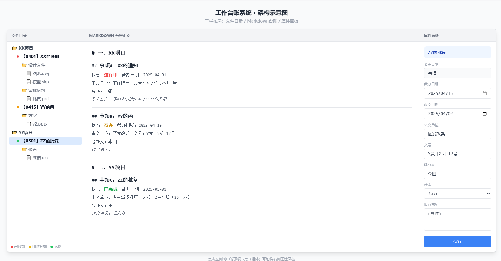

# Work_Overview 开发日志
## 方案
### 总体架构
- 我想做一个办理事项全览界面程序，用nicegui，整个处室内网都能看到。
- Web 架构：使用 NiceGUI 搭建 Web 系统，用户通过浏览器（Chrome/Edge）访问，服务端统一部署。
- 三栏，左侧目录树，中间台账正文，右侧属性面板。
```
页面布局，三栏
┌──────────┬─────────────────┬──────────┐
│          │                 │          │
│ 文件目录  │  markdown台账   │ 属性面板  │
│ (树)     │  (正文编辑器)    │ (表单)   │
│          │                 │          │
│ 📁 XX项目 │ # 一、XX项目    │ ▎事项A   │
│  事项A ● │ ## 事项A        │          │
│   📁 设计 │ ...            │ 类型：事项 │
│   📁 报告 │                │ 截办：4/1 │
│  事项B   │ ## 事项B        │ 收文：3/25│
│ 📁 YY项目 │ ...            │ 经办：张三 │
│          │                 │ 状态：进行中│
│          │                 │          │
│          │                 │ [保存]   │
└──────────┴─────────────────┴──────────┘

属性面板布局
┌────────────────┐
│ ▎事项A          │
│                │
│ 标题：XX的通知   │
│ 截办：2025-04-01│
│ 收文：2025-03-25│
│ 来文单位：市住建局│
│ 文号：X办发〔25〕3号│
│ 经办人：张三     │
│ 状态：进行中  ▼  │
│                │
│ 拟办意见：       │
│ ┌────────────┐ │
│ │请XX科阅处，  │ │
│ │4月15日前反馈 │ │
│ └────────────┘ │
│                │
│ [保存]         │
└────────────────┘
```



### 左侧目录树
#### 属性
- 文件视图，部分节点是右侧台账正文的标题，比如事项，部分节点不是台账正文标题，比如事项节点的子文件夹/文件。凡是在正文中有标题的节点在目录树中用粗体加一个浅色背景显示，不需要黑框那么重。
- 节点目前分几类：从OA系统下载下来的待办事项（对应一个文件夹，里边包含附件文件夹、办公依据文件夹，还有表单和正文两个文件）、 数据库文件夹（比如，包含工作需要的各种项目台账、国家法律法规等等资料）、标题（没有对应的文件夹，只对应右侧正文某个标题）、普通文件夹、事项系列文件夹（一个事情可能持续很久，比如党建，里边会包含很多已办理事项）。
- 节点名字由用户录入，会弹出一个小表单界面（或者不用弹，就放在左侧目录树下边常驻），用户填表单 → 字段存数据库 → 系统拼出显示名。【20250401】【20250325】XX的通知 这种名字是系统根据用户输入的表单生成的，用户想重命名也得在表单修改。
- 待办事项
  - 所有待办事项统一放在最外层，办完了才放入已办理事项文件夹或者某个系列事项文件夹。待办事项名字遵循统一的格式：【截办日期】【收文日期】事项名称，比如“【20250401】【20250325】XX的通知”
  - 每个待办事项都有OA系统赋予的独一无二的流水号，纯数字，但是为了简便，决定不在名称显示，而是放在数据库，如果用户想看详细信息是可以的。


- 已办理事项。有个单独的已办理文件夹收录所有已办理事项，如果这个已办理事项和某个系列事项文件夹有隶属关系，比如是党建相关，那就放进对应的系列事项文件夹里边。
- 理论上来说每个系列事项文件夹都会有一个数据库子文件夹，放着相关数据。


- 界面组织
  - 界面目录与真实文件解耦：左侧目录树按逻辑架构组织（事项维度），不暴露真实文件路径给用户。真实文件存放在共享文件夹中，路径由数据库管理。
  - 元数据存数据库：事项名称、日期、阶段、状态等信息全部存数据库，筛选排序走数据库，不依赖文件夹命名。这样即使文件夹名被改动也不影响系统核心功能。

#### 功能
- 点击节点要立即能跳转到右侧正文相应内容。
- 节点应该有右侧菜单，包括 重命名，打开文件夹（如果是事项节点或者数据库文件夹，它们的子文件/文件夹不打算在目录树展示，所以会设置这个功能弹出新面板查看。或者考虑交给用户自己选择，当建立一个文件夹时，选择是否把其子文件/子文件夹加入到目录树作节点展示出来，默认不展示），复制、粘贴、剪切等功能
- 左侧目录树以后可能加上 筛选、排序、搜索功能，可能会根据用户输入的关键词检索事项文件夹里边的文件名称。
- 双击节点可以打开文件（如果是文件夹则在界面上展开显示其子节点即可，如果是文件则调用用户机子上本地默认应用程序打开该文件）。
  - 文件打开方案：浏览器安全策略禁止网页直接访问本地文件系统。自定义协议 openfile://，通过一个轻量中间程序 file_opener.exe 桥接浏览器和本地系统。
  - 默认程序 os.startfile() 调用 Windows 系统默认程序打开文件，.docx 用 Word 或 WPS，.xlsx 用 Excel 或 WPS 表格，无需为每种格式指定程序。用户想换程序去 Windows 设置改默认程序即可。
  - Chrome、Edge、Firefox、Opera 均支持 NiceGUI 和自定义协议。内网 Windows 7 已有 Chrome 可直接使用。国产系统 + 奇安信浏览器暂不考虑，后续再适配。
  - 主要靠：不暴露真实路径，用户只通过 Web 界面操作。后续可加：文件服务器 NTFS 权限控制，文件夹只读不可改名删除，文件可正常编辑。


### 右侧正文
- 右侧连续文档，可编辑，打算用markdown编辑器。如果需要导出为word文档，pandoc 或者 python-docx 都能把 Markdown 转成 docx。
- 改了文字内容要立即在左侧目录树同步。同样，左侧目录节点改了文字也要立即同步在右侧正文。


## 计划

- 自动下载OA待办公文到共享文件夹，然后添加标题到左侧目录，


## 2026-04-14

### 完成
- 项目初始化，搭建 NiceGUI 骨架
- 左右分栏布局：左侧树形导航 + 右侧详情面板
- 顶部工具栏（新建文件夹、新建文档、重命名、删除按钮占位）
- 假数据验证界面可跑通

### 决策记录
- 框架选型：NiceGUI（Python 全栈，不写前端）
- 代码风格：函数定义在前，界面和事件绑定写在一起（可读性优先）
- 拆分方案（界面/行为/绑定三段式）试过后放弃，绑定事件时对应关系不直观


---

## 2026-04-16
### 完成
- 禁止整个页面滚动
- 把右侧面板做成连续可读的